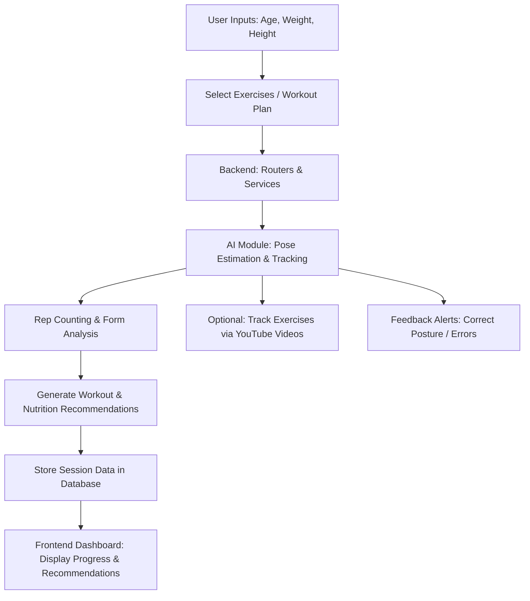

# 🏋️‍♀️ AI Exercise Tracker

---

## 🧠 Project Overview

**AI Exercise Tracker** is a web-based application that helps users track, analyze, and optimize their workouts using AI and computer vision.  
It collects personal data (age, weight, height, etc.) and tracks exercises in real-time using AI models.  
The system also provides **personalized workout routines**, **nutrition guidance**, and **session tracking**.

---

## 🎯 Features

- **User Profile Management**: Capture user details like age, sex, weight, height.  
- **Exercise Setup & Tracking**: Select predefined exercises or custom routines.  
- **Real-Time Pose Detection**: Analyze user movements and count repetitions accurately.  
- **Workout & Nutrition Recommendations**: Personalized plans based on user goals.  
- **Session Logging**: Track completed workouts and nutrition sessions.  
- **YouTube Video Support**: Supports exercise tracking directly from YouTube workout videos.  
- **API-Driven Architecture**: Modular backend using FastAPI for scalability.  
- **Testing Suite**: Includes automated tests for backend services and endpoints.  

---

## 🛠 Tech Stack

- **Backend**: Python, FastAPI  
- **AI & ML**: TensorFlow, MediaPipe  
- **Frontend**: Streamlit  
- **Database**: SQLite 
- **Other Tools**: OpenCV, Pydantic, Python-dotenv, Gemini API  

---

## 📁 Project Structure
```text
└── poojitha319-ai-exercise-tracker/
    ├── README.md
    ├── requirements.txt
    ├── app/
    │   ├── __init__.py
    │   ├── database.py
    │   ├── main.py
    │   ├── test.py
    │   ├── backend/
    │   │   ├── __init__.py
    │   │   ├── models/
    │   │   │   ├── __init__.py
    │   │   │   ├── exercise.py
    │   │   │   ├── gemini_model.py
    │   │   │   ├── pose_model.py
    │   │   │   └── prompts.py
    │   │   ├── routers/
    │   │   │   ├── __init__.py
    │   │   │   ├── exercises.py
    │   │   │   ├── health.py
    │   │   │   ├── meals.py
    │   │   │   ├── nutrition.py
    │   │   │   ├── sessions.py
    │   │   │   └── workouts.py
    │   │   ├── schemas/
    │   │   │   ├── __init__.py
    │   │   │   ├── exercises.py
    │   │   │   ├── meal.py
    │   │   │   ├── nutrition.py
    │   │   │   ├── session.py
    │   │   │   └── workout.py
    │   │   └── services/
    │   │       ├── __init__.py
    │   │       ├── exercises_service.py
    │   │       ├── meal_service.py
    │   │       ├── nutrition_service.py
    │   │       ├── session_service.py
    │   │       └── workout_service.py
    │   └── frontend/
    │       └── app.py
    └── tests/
        ├── __init__.py
        ├── test_meals.py
        ├── test_services.py
        └── test_workout.py
```
## ⚙️Installation & Setup
✅ Prerequisites
Python 3.10+

Git

🚀 Steps
1. Clone the repository
```bash
git clone https://github.com/Poojitha319/ai-exercise-tracker.git
cd poojitha319-ai-exercise-tracker
```
2. Create and activate a virtual environment
```bash
python -m venv venv
```
3. Install dependencies
```bash
pip install -r requirements.txt
```
4. Create a .env file in the root director
```env
DATABASE_URL="sqlite:///./exercise_tracker.db"
SECRET_KEY="your-secret-key"
```
6. Run the FastAPI backend
```bash
uvicorn app.main:app --reload
```
7. Launch the Streamlit frontend
```bash
streamlit run app/frontend/app.py
```
## 📸 Demo

[](./demo/demo.mp4)

🧪 Testing
Run automated tests:
```bash
pytest tests/
```
---
🗺️ Workflow Diagram

---
👩‍💻 Author
Developed by Poojitha319
